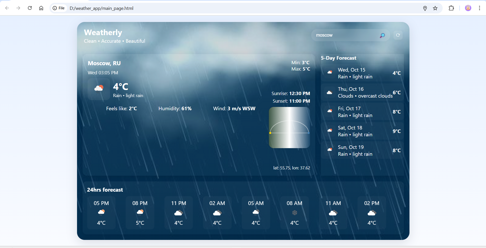
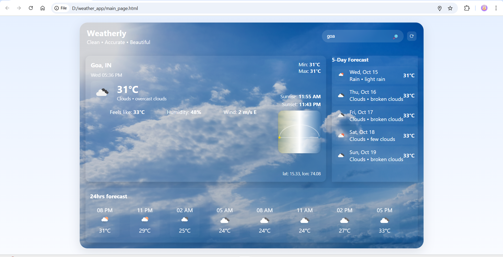

# Weather App

A **modern, responsive Weather App** built using **HTML, CSS, and JavaScript**, powered by the **OpenWeatherMap API**.  
It shows real-time weather updates, 24-hour forecasts, and 5-day trends for any city worldwide — all in a sleek, professional UI.

##  App Preview

### Screenshot


 
## Features

 Search weather by **city name**  
 Displays **temperature, humidity, wind speed, and pressure**  
 Shows **sunrise/sunset times** with icons 
 Includes **24-hour** and **5-day forecast** sections  
 **Dynamic backgrounds** that match weather conditions (e.g., rain, snow, clear)  
 Fully **responsive design** — works on desktop and mobile  

## Technology 
**HTML5** - Structure of the app 
**CSS3** - Styling, gradients, layout, and responsiveness 
**JavaScript** - Logic, API handling, DOM updates 
**OpenWeatherMap API** - Provides real-time weather data 

## Installation & Setup

Follow these simple steps to run it locally 

1. **Clone this repository**
    ```bash
    git clone https://github.com//weather-app.git
    cd weather-app
    Get your API key

2.  **Visit OpenWeatherMap**
    Sign up and generate your free API key
    Add your API key
    Open the script.js file

3.  **Find:**
    js
    Copy code
    const apiKey = "YOUR_API_KEY";
    Replace "YOUR_API_KEY" with your actual key

4.  **Run the app**
    Open main_page.html in your browser
    Type any city name and press Enter or click the search icon 

## How It Works

    The user enters a city name
    The app fetches weather data via the OpenWeatherMap API
    The JSON response is parsed
    UI updates dynamically — showing current weather, forecasts, and matching icons
    Background theme changes based on the weather type

## Future Improvements

    Auto-detect current location using Geolocation API
    Add alerts for extreme weather
    Save recent searches in local storage
    Convert to a Progressive Web App (PWA)
    Add hourly temperature chart visualization
